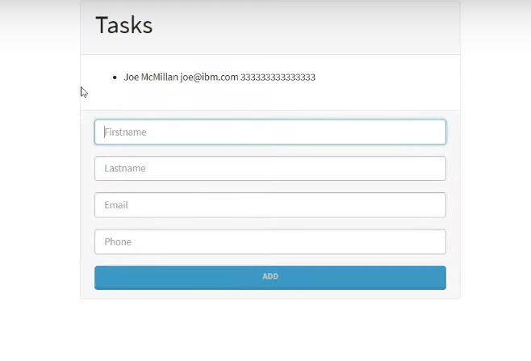

$env:GOOGLE_APPLICATION_CREDENTIALS="C:\Users\PC DELL\OneDrive\Escritorio\Programas\cocactos nodejs/node-firebase-cd3e9-firebase-adminsdk-ky409-e370e03c08.json"

Esta es la tarea de Gaddiel Comas, segui un tutorial para realizarla con firebase y comenzar a usarlo, ya que vi en el grupo que usted dijo que se podia hacer con alguna base de datos.

